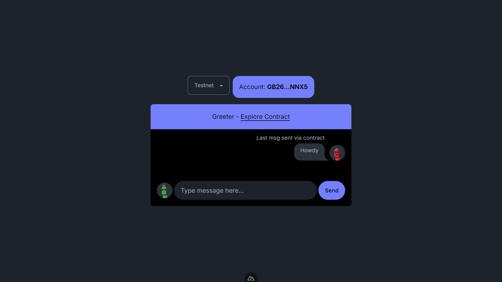

# About this tutorial 🌟



An app showing a simple soroban contract interaction, used in this tutorial: https://soroban-js-docs.netlify.app/

# Development
```bash
# install dependencies
npm i

# run locally
npm run dev
```

Leave a 🌟 if you found this helpful.